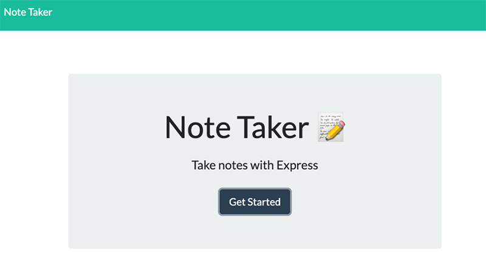

# **Express Notetaker App**

## Description 
For users that need to keep track of a lot of information, it's easy to forget or be unable to recall something important. Being able to take persistent notes allows users to have written information available when needed. The notetaker app helps with this.

## Screenshots

## Table of contents
- [Description](#Description)
- [Installation](#Installation)
- [Licence](#Licence)
- [Repository Link](#Repository)
- [Diployed App Info](#App) 
- [GitHub Info](#GitHub) 
## Installation
        npm install
## Licence
MIT
## Repository
- [Express Notetaker App Repo](https://github.com/meddle74/expressNoteTaker)

## App
- [Express Notetaker App on Heroku](https://notetaker-jpljr.herokuapp.com/)
## GitHub
- Email: jpatricklloyd@gmail.com
- [GitHub Profile](https://github.com/Meddle74)
